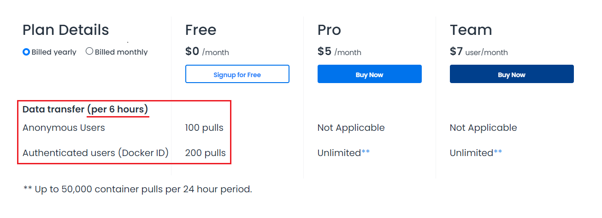

# Run Container

## Docker Container Lifecycle

> If there are no images in local docker-engine,  
> to start the container, pulling docker image from docker repository first.

### Docker Image --[[`pull`](https://docs.docker.com/engine/reference/commandline/pull/) + [`run`](https://docs.docker.com/engine/reference/commandline/run/)]--> Docker Container (`running`)

```bash
# Pull an image or a repository from a registry
docker pull [OPTIONS] NAME[:TAG|@DIGEST]

# Run a command in a new container
docker run [OPTIONS] IMAGE [COMMAND] [ARG...]
```

### Docker Container (`running`) --[[`stop`](https://docs.docker.com/engine/reference/commandline/stop/)]--> Docker Container (`stopped`)

```bash
# Stop one or more running containers
docker stop [OPTIONS] CONTAINER [CONTAINER...]
```

### Docker Container (`stopped`) --[[`start`](https://docs.docker.com/engine/reference/commandline/start/)]--> Docker Container (`runnning`)

```bash
# Start one or more stopped containers
docker start [OPTIONS] CONTAINER [CONTAINER...]
```

### Docker Container (`stopped`) --[[`rm`](https://docs.docker.com/engine/reference/commandline/rm/)]--> (`removed`)

```bash
# Remove one or more containers
docker rm [OPTIONS] CONTAINER [CONTAINER...]
```

---

## Usage limits on `Free tier`

- [Docker Hub Pricing](https://www.docker.com/pricing)

- [Docker Hub Policy - Download rate limit](https://docs.docker.com/docker-hub/download-rate-limit/)


